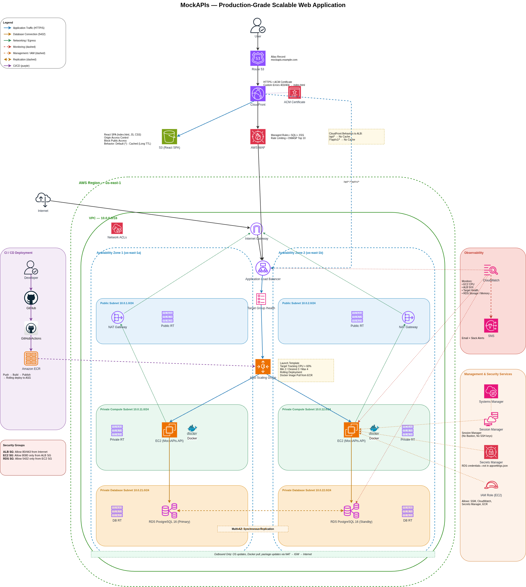

# MockAPIs — Production-Grade AWS Deployment


Deploy a production-ready **ASP.NET Core REST API** on AWS using **EC2 Auto Scaling**, **Application Load Balancer**, **CloudFront**, **Amazon RDS PostgreSQL**, and **Docker**. The frontend is hosted on Amazon S3 and distributed globally through CloudFront, while the backend runs inside private subnets across multiple Availability Zones.

---

# Table of Contents

- [Architecture Diagram](#architecture-diagram)
- [Technology Stack](#technology-stack)
- [Architecture: EC2-based](#architecture-ec2-based)
- [Project Overview](#project-overview)
- [How It Works](#how-it-works)
- [Key AWS Services Used](#key-aws-services-used)
- [Benefits](#benefits)
- [Learning Outcomes](#learning-outcomes)
- [Architecture Components](#architecture-components)
- [Scaling Behavior](#scaling-behavior)
- [Database Configuration](#database-configuration)
- [Monitoring and Alerts](#monitoring-and-alerts)
- [Cost Optimization](#cost-optimization)
- [Deployment Process](#deployment-process)
- [Common Use Cases](#common-use-cases)
- [Troubleshooting Guide](#troubleshooting-guide)

---

# Architecture Diagram


---

# Request Flow

```text
                    User
                     │
                     ▼
            Amazon Route 53
                     │
                     ▼
          Amazon CloudFront (CDN)
                     │
                     ▼
                 AWS WAF
          ┌──────────┴──────────┐
          │                     │
          ▼                     ▼
 Amazon S3 (React SPA)      Application
                             Load Balancer
                                    │
                                    ▼
                              Target Group
                                    │
                     ┌──────────────┴──────────────┐
                     ▼                             ▼
             EC2 Instance                  EC2 Instance
           (Docker ASP.NET API)         (Docker ASP.NET API)
                     │                             │
                     └──────────────┬──────────────┘
                                    ▼
                        Amazon RDS PostgreSQL
                               (Multi-AZ)
```

---

# Technology Stack

| Category | Technologies |
|-----------|--------------|
| Frontend | React, TypeScript, Vite |
| Backend | ASP.NET Core 9 Web API |
| Database | Amazon RDS PostgreSQL 16 |
| Containerization | Docker |
| Compute | Amazon EC2 |
| Scaling | Auto Scaling Group |
| Load Balancing | Application Load Balancer |
| CDN | Amazon CloudFront |
| Storage | Amazon S3 |
| Security | AWS WAF, IAM, Secrets Manager |
| Monitoring | Amazon CloudWatch, SNS |
| Administration | AWS Systems Manager |
| CI/CD | GitHub Actions, Amazon ECR |
| DNS | Amazon Route 53 |

---

# Architecture: EC2-based

This project demonstrates how to deploy a production-ready web application on AWS using EC2 instances, Auto Scaling Groups (ASG), and an Application Load Balancer (ALB). The architecture is designed for high availability, fault tolerance, and automatic scaling while following AWS Well-Architected Framework best practices.

The React frontend is hosted on Amazon S3 and distributed globally through CloudFront, while the ASP.NET Core API runs inside Docker containers on EC2 instances located in private subnets. Application data is stored in Amazon RDS PostgreSQL configured with Multi-AZ for automatic failover.

---

# Project Overview

MockAPIs is a cloud-native REST API infrastructure built to simulate a real-world production deployment on AWS.

The project separates networking, compute, storage, security, monitoring, and deployment into dedicated AWS managed services. This design improves scalability, simplifies operations, and reduces operational overhead compared to a traditional single-server deployment.

Key objectives include:

- Deploy a highly available REST API.
- Host a React SPA using Amazon S3 and CloudFront.
- Automatically scale compute resources.
- Secure the infrastructure using AWS networking best practices.
- Implement centralized monitoring and alerting.
- Demonstrate a modern CI/CD workflow using Docker and GitHub Actions.

---

# How It Works

1. Users access the application using a custom domain managed by **Amazon Route 53**.
2. **CloudFront** serves cached frontend assets directly from Amazon S3.
3. API requests are inspected by **AWS WAF** before reaching the backend.
4. The **Application Load Balancer** distributes requests across healthy EC2 instances.
5. Docker containers running the ASP.NET Core API process incoming requests.
6. Application data is stored securely in **Amazon RDS PostgreSQL**.
7. CloudWatch collects logs and metrics while SNS sends operational alerts.

---

# Key AWS Services Used

## Amazon Route 53

Provides DNS resolution for the application's custom domain and routes users to the CloudFront distribution.

---

## Amazon CloudFront

Accelerates global content delivery by caching static frontend assets while forwarding API requests to the backend without caching.

---

## Amazon S3

Hosts the React Single Page Application using Origin Access Control (OAC), preventing direct public access to the bucket.

---

## AWS WAF

Protects the application from SQL Injection, Cross-Site Scripting (XSS), bots, and common OWASP Top 10 attacks before traffic reaches the backend.

---

## Amazon VPC

Creates an isolated virtual network with public and private subnets distributed across multiple Availability Zones.

---

## Application Load Balancer (ALB)

Distributes incoming API traffic across healthy EC2 instances and continuously performs health checks.

---

## Amazon EC2

Runs the Dockerized ASP.NET Core REST API inside private subnets without exposing the application servers directly to the internet.

---

## Auto Scaling Group (ASG)

Automatically launches or terminates EC2 instances according to application demand, ensuring consistent performance and cost efficiency.

---

## Amazon RDS PostgreSQL

Provides a managed PostgreSQL database with Multi-AZ deployment, automatic backups, and automatic failover.

---

## AWS Secrets Manager

Securely stores database credentials and sensitive configuration used by the application.

---

## Amazon CloudWatch & Amazon SNS

Collect infrastructure metrics, application logs, and operational alarms while notifying administrators through email or Slack.

---

## AWS Systems Manager

Provides secure remote administration without requiring SSH keys, Bastion Hosts, or public EC2 instances.

---

## Amazon Elastic Container Registry (ECR)

Stores Docker images that are deployed automatically to EC2 instances.

---

## GitHub Actions

Automates the build, test, containerization, and deployment process whenever new code is pushed to the repository.


# Benefits

This architecture is designed to provide a secure, scalable, and highly available environment suitable for production workloads.

### High Availability

Resources are deployed across multiple Availability Zones. If an EC2 instance or an entire Availability Zone becomes unavailable, the Application Load Balancer automatically redirects traffic to healthy instances while the Auto Scaling Group launches replacements when necessary.

### Automatic Scaling

The Auto Scaling Group continuously monitors application demand and automatically adjusts the number of EC2 instances, ensuring consistent performance during traffic spikes while minimizing infrastructure costs during low-traffic periods.

### Improved Security

Application servers and the database remain inside private subnets with no direct internet access. AWS WAF filters malicious requests before they reach the application, while IAM Roles and AWS Secrets Manager eliminate the need for hardcoded credentials.

### Better Performance

CloudFront caches static frontend assets at edge locations around the world, reducing latency and minimizing requests reaching the backend infrastructure.

### Operational Simplicity

Using managed AWS services such as Amazon RDS, CloudWatch, Systems Manager, and Auto Scaling reduces administrative overhead and allows developers to focus on application development instead of infrastructure management.

---

# Learning Outcomes

Building this project provides hands-on experience with several core AWS services and production deployment practices.

After completing this project, you will understand how to:

- Design secure VPC architectures using public and private subnets.
- Deploy containerized ASP.NET Core applications on Amazon EC2.
- Configure Application Load Balancers and Target Groups.
- Implement automatic horizontal scaling using Auto Scaling Groups.
- Deploy highly available PostgreSQL databases using Amazon RDS Multi-AZ.
- Secure cloud applications using IAM, AWS WAF, and Secrets Manager.
- Monitor applications using Amazon CloudWatch and Amazon SNS.
- Build automated CI/CD pipelines with GitHub Actions and Amazon ECR.
- Apply AWS Well-Architected Framework best practices to real-world applications.

---

# Architecture Components

The infrastructure is divided into multiple layers, each responsible for a specific part of the application.

## Edge Layer

Responsible for handling incoming user traffic.

Components:

- Amazon Route 53
- Amazon CloudFront
- AWS WAF
- Amazon S3

Responsibilities:

- DNS resolution
- Global content delivery
- HTTPS support
- Static website hosting
- Web application firewall protection

---

## Networking Layer

Provides secure communication between AWS resources.

Components:

- Amazon VPC
- Internet Gateway
- NAT Gateways
- Public Subnets
- Private Compute Subnets
- Private Database Subnets
- Route Tables
- Security Groups
- Network ACLs

Responsibilities:

- Network isolation
- Internet connectivity
- Private networking
- Access control
- Traffic routing

---

## Compute Layer

Responsible for processing API requests.

Components:

- Application Load Balancer
- Target Group
- Auto Scaling Group
- Amazon EC2
- Docker

Responsibilities:

- Load balancing
- Health checks
- Horizontal scaling
- Application hosting

---

## Data Layer

Responsible for persistent application storage.

Components:

- Amazon RDS PostgreSQL
- Multi-AZ Deployment

Responsibilities:

- Data persistence
- Automatic backups
- High availability
- Automatic failover

---

## Operations Layer

Responsible for monitoring and administration.

Components:

- Amazon CloudWatch
- Amazon SNS
- AWS Systems Manager
- AWS Secrets Manager
- IAM

Responsibilities:

- Metrics collection
- Log aggregation
- Alert notifications
- Secure administration
- Secret management

---

## Deployment Layer

Responsible for automated software delivery.

Components:

- GitHub
- GitHub Actions
- Amazon ECR

Responsibilities:

- Source control
- Automated builds
- Docker image management
- Continuous deployment

---

# Scaling Behavior

The application automatically adjusts compute capacity according to workload using an Auto Scaling Group and Target Tracking policies.

## When Traffic Increases

1. CloudWatch detects increased CPU utilization.
2. Auto Scaling launches a new EC2 instance.
3. The new instance pulls the latest Docker image from Amazon ECR.
4. The instance registers with the Target Group.
5. The Application Load Balancer begins routing traffic after the health check succeeds.

---

## When Traffic Decreases

1. CloudWatch detects reduced resource utilization.
2. Auto Scaling selects an instance for termination.
3. The instance enters the connection draining state.
4. Existing requests complete successfully.
5. The instance is terminated to reduce infrastructure costs.

---

## Scaling Configuration

| Setting | Value |
|----------|-------|
| Minimum Instances | 2 |
| Desired Instances | 2 |
| Maximum Instances | 4 |
| Scaling Policy | Target Tracking |
| Metric | EC2 CPU Utilization |
| Health Check | `/health` |

---

# Database Configuration

The application stores all persistent data in **Amazon RDS PostgreSQL 16** using a **Multi-AZ deployment** for high availability and automatic failover.

### Features

- PostgreSQL 16
- Multi-AZ deployment
- Automated backups
- Point-in-Time Recovery
- Automatic patching
- CloudWatch monitoring
- Managed storage
- Automatic failover

### Security

The database resides inside private database subnets and is never exposed to the public internet.

Only EC2 instances within the application Security Group are allowed to connect over **TCP port 5432**.

Database credentials are securely stored in **AWS Secrets Manager**, preventing sensitive information from being stored inside the application or source code.

### Backup and Recovery

Amazon RDS automatically creates backups and transaction logs, allowing the database to be restored to a specific point in time if required.

In the event of a database failure, the standby instance is promoted automatically with minimal interruption to the application.

# Monitoring and Alerts

The infrastructure is monitored using **Amazon CloudWatch**, which collects metrics, logs, and operational events from the application and AWS resources.

CloudWatch Alarms notify administrators through **Amazon SNS** whenever predefined thresholds are exceeded, allowing issues to be detected and resolved before they impact users.

### Metrics Monitored

- EC2 CPU Utilization
- Application Load Balancer Request Count
- ALB HTTP 4XX / 5XX Errors
- Target Group Health Status
- RDS CPU Utilization
- Database Connections
- Free Storage Space
- Network Traffic

### Alert Notifications

Amazon SNS delivers notifications for:

- High CPU utilization
- Unhealthy application instances
- Database performance issues
- Auto Scaling events
- Critical CloudWatch alarms

---

# Cost Optimization

The architecture is designed to balance performance and operational costs by leveraging AWS managed services and automatic scaling.

### Cost Optimization Strategies

- Auto Scaling removes unnecessary EC2 instances during low traffic.
- CloudFront caches static assets, reducing backend requests.
- Amazon S3 serves frontend files at a lower cost than EC2.
- Private EC2 instances share NAT Gateway access for outbound internet connectivity.
- Amazon RDS automates backups, patching, and maintenance, reducing operational effort.
- Docker enables consistent deployments without maintaining multiple server configurations.

### Additional Recommendations

- Use Reserved Instances or Savings Plans for predictable workloads.
- Configure ECR lifecycle policies to remove unused images.
- Set CloudWatch log retention periods.
- Monitor spending with AWS Budgets and Cost Explorer.

---

# Deployment Process

Application deployments are fully automated using **GitHub Actions** and **Amazon ECR**.

## Deployment Workflow

```text
Developer
    │
    ▼
GitHub Repository
    │
    ▼
GitHub Actions
    │
    ├── Restore Dependencies
    ├── Build Application
    ├── Run Tests
    ├── Build Docker Image
    └── Push Image to Amazon ECR
                    │
                    ▼
          EC2 Instances Pull Latest Image
                    │
                    ▼
         Docker Containers Restart
                    │
                    ▼
      ALB Health Checks Validate Deployment
```

### Deployment Steps

1. Push source code to GitHub.
2. GitHub Actions builds and tests the application.
3. A new Docker image is created.
4. The image is pushed to Amazon ECR.
5. EC2 instances pull the latest image.
6. Docker containers restart with the new version.
7. The Application Load Balancer routes traffic only to healthy instances.

---

# Common Use Cases

This architecture is suitable for a wide range of production workloads.

### REST APIs

Highly available backend services for web and mobile applications.

### SaaS Applications

Multi-user platforms requiring automatic scaling and secure infrastructure.

### Internal Enterprise Systems

Business applications such as HR, ERP, CRM, and inventory management systems.

### E-Commerce Platforms

Applications that experience traffic spikes during sales and promotional events.

### Learning Platforms

Educational systems, online exams, and training portals that require high availability and reliable database storage.

---

# Troubleshooting Guide

| Problem | Possible Cause | Recommended Solution |
|----------|----------------|----------------------|
| EC2 instance is unhealthy | Application failed or health endpoint unavailable | Check Docker containers, application logs, and `/health` endpoint. |
| API returns **502 Bad Gateway** | Backend application is unavailable | Verify the Target Group, container status, and ALB configuration. |
| Database connection failed | Incorrect credentials or blocked traffic | Verify AWS Secrets Manager values and Security Group rules. |
| Auto Scaling does not launch instances | Scaling policy or service limits | Review Auto Scaling policies and CloudWatch metrics. |
| CloudFront serves outdated files | Cached frontend assets | Create a CloudFront invalidation after deployment. |
| High application latency | Increased traffic or slow database queries | Review CloudWatch metrics and optimize application or database performance. |


---

# Conclusion

MockAPIs demonstrates a production-ready AWS architecture built around scalability, security, reliability, and operational excellence.

By combining Amazon EC2, Application Load Balancer, Auto Scaling, CloudFront, Amazon RDS PostgreSQL, Docker, and managed AWS services, the project showcases how modern cloud-native applications can be deployed following AWS Well-Architected Framework best practices.

This project serves as a practical reference for learning AWS architecture, preparing for cloud certifications, and building a professional cloud engineering portfolio.