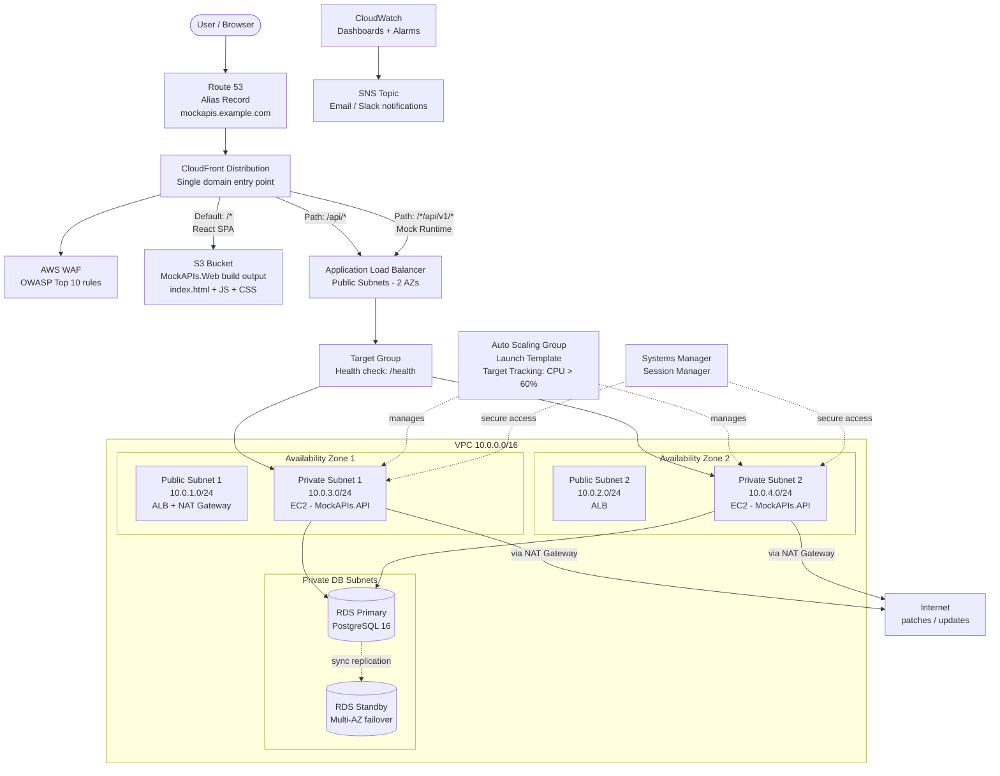

# MockAPIs — AWS Architecture (Full-Stack)

## Overview

MockAPIs is now a full-stack application:
- **Frontend**: React SPA (`MockAPIs.Web`) — static files served from S3 via CloudFront
- **Backend**: ASP.NET Core Web API (`MockAPIs.API`) — runs on EC2 instances behind ALB

This architecture separates static asset delivery from API compute, using CloudFront as the single entry point with two origins.

---

## Architecture Diagram



---

## Request Flow

### Static Assets (React SPA)
```
User → Route 53 → CloudFront (default origin) → S3 Bucket
```
CloudFront serves the built React app (`index.html`, JS bundles, CSS).
All client-side routes (e.g. `/projects`, `/login`) return `index.html` via CloudFront's custom error response (404 → 200 → `/index.html`).

### Management API Requests
```
User → Route 53 → CloudFront (/api/*) → WAF → ALB → EC2 (private subnet) → RDS
```
Authenticated requests from the React SPA to endpoints like `POST /api/Auth/Login`, `GET /api/Project`, etc.

### Mock Runtime API Requests
```
User → Route 53 → CloudFront (/{token}/api/v1/*) → WAF → ALB → EC2 (private subnet) → RDS
```
Public mock API consumption by end-users via dynamic routes like `GET /{token}/api/v1/products`.

---

## AWS Services Breakdown

| Service | Purpose |
|---|---|
| **Route 53** | DNS with alias record pointing to CloudFront, health checks |
| **CloudFront** | CDN — serves React SPA from S3 (default origin), proxies API calls to ALB (second origin) |
| **S3** | Hosts React SPA static build output (`npm run build` → `dist/`) |
| **WAF** | Attached to CloudFront, OWASP Top 10 managed rule groups |
| **ALB** | Layer 7 load balancer in public subnets across 2 AZs |
| **EC2 + ASG** | .NET 9 API instances in private subnets, auto-scaled via target tracking (CPU > 60%) |
| **RDS Multi-AZ** | PostgreSQL with synchronous standby replication and automated failover |
| **NAT Gateway** | Outbound internet access for EC2 instances (package updates, external APIs) |
| **Systems Manager** | Session Manager for bastion-free SSH access to private EC2 instances |
| **CloudWatch + SNS** | Metrics dashboards, CPU/memory alarms, email/Slack notifications |

---

## CloudFront Configuration

### Origin 1 — S3 (React SPA)
- **Origin**: S3 bucket (`mockapis-web-{env}`)
- **Origin Access Control (OAC)**: Restricts S3 access to CloudFront only
- **Default Behavior**: `/*` → S3 origin
- **Cache Policy**: `CachingOptimized` for JS/CSS, short TTL for `index.html`
- **Custom Error Response**: 403/404 → `/index.html` with 200 status (SPA routing)

### Origin 2 — ALB (API)
- **Origin**: ALB DNS name
- **Behavior 1**: `/api/*` → ALB origin
- **Behavior 2**: `/*/api/v1/*` → ALB origin (mock runtime wildcard)
- **Cache Policy**: `CachingDisabled` (API responses should not be cached)
- **Origin Request Policy**: `AllViewerExceptHostHeader`

---

## Security Architecture

```
Internet
    │
    ▼
┌─────────────────────────┐
│  CloudFront + WAF       │  OWASP Top 10, rate limiting
└─────────┬───────────────┘
          │
┌─────────▼───────────────┐
│  ALB Security Group     │  Inbound: 443 from CloudFront prefix list
│  (Public Subnets)       │
└─────────┬───────────────┘
          │
┌─────────▼───────────────┐
│  EC2 Security Group     │  Inbound: 5000 from ALB SG only
│  (Private Subnets)      │
└─────────┬───────────────┘
          │
┌─────────▼───────────────┐
│  RDS Security Group     │  Inbound: 5432 from EC2 SG only
│  (Private DB Subnets)   │
└─────────────────────────┘
```

- **No public IPs** on EC2 or RDS instances
- **No bastion host** — use Systems Manager Session Manager
- **S3 bucket** is private, accessible only via CloudFront OAC
- **NACLs** on each subnet tier as defense-in-depth

---

## Deployment Pipeline

```
1. Frontend (React SPA):
   npm run build → aws s3 sync dist/ s3://mockapis-web/ → CloudFront invalidation

2. Backend (ASP.NET Core API):
   dotnet publish → Package as AMI or deploy via CodeDeploy → Rolling update via ASG
```

---

## Subnet Layout

| Subnet | CIDR | AZ | Purpose |
|---|---|---|---|
| Public Subnet 1 | 10.0.1.0/24 | AZ-1 | ALB, NAT Gateway |
| Public Subnet 2 | 10.0.2.0/24 | AZ-2 | ALB |
| Private Subnet 1 | 10.0.3.0/24 | AZ-1 | EC2 (MockAPIs.API) |
| Private Subnet 2 | 10.0.4.0/24 | AZ-2 | EC2 (MockAPIs.API) |
| DB Subnet 1 | 10.0.5.0/24 | AZ-1 | RDS Primary |
| DB Subnet 2 | 10.0.6.0/24 | AZ-2 | RDS Standby |
