# MockAPIs — System Design

## High Level Architecture

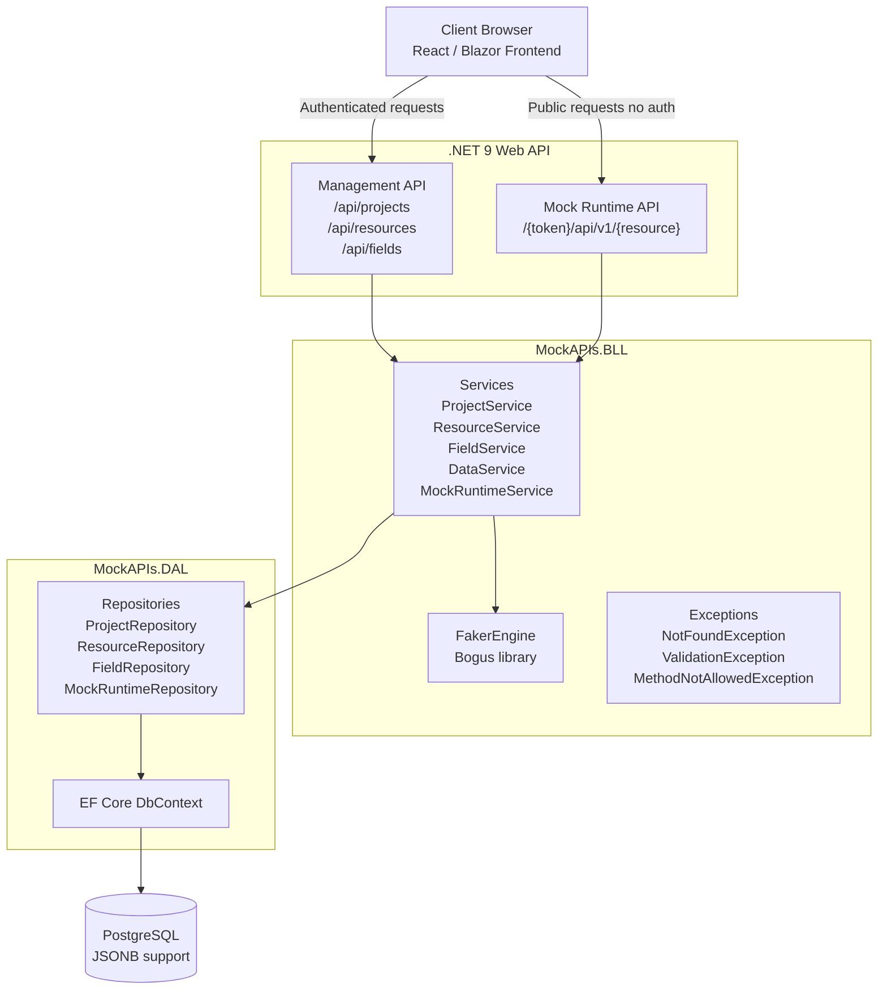

---

## 3-Tier Layer Breakdown

```mermaid
graph LR
    subgraph API["MockAPIs.API"]
        direction TB
        ProjectsController
        ResourcesController
        FieldsController
        EndpointConfigsController
        DataController
        MockRuntimeController["MockRuntimeController\ncatch-all dynamic"]
        ExceptionMiddleware
    end

    subgraph BLL["MockAPIs.BLL"]
        direction TB
        IProjectService --> ProjectService
        IResourceService --> ResourceService
        IFieldService --> FieldService
        IDataService --> DataService
        IMockRuntimeService --> MockRuntimeService
        FakerEngine
        NotFoundException
        ValidationException
        MethodNotAllowedException
        UnauthorizedException
    end

    subgraph DAL["MockAPIs.DAL"]
        direction TB
        AppDbContext
        IProjectRepository --> ProjectRepository
        IResourceRepository --> ResourceRepository
        IFieldRepository --> FieldRepository
        IDataRepository --> DataRepository
        IMockRuntimeRepository --> MockRuntimeRepository
        AppUser
        Project
        Resource
        Field
        MockRecord
        EndpointConfig
    end

    API -->|calls interfaces| BLL
    BLL -->|calls interfaces| DAL
    DAL --> PostgreSQL[("PostgreSQL")]
```

---

## Database Schema (ERD)

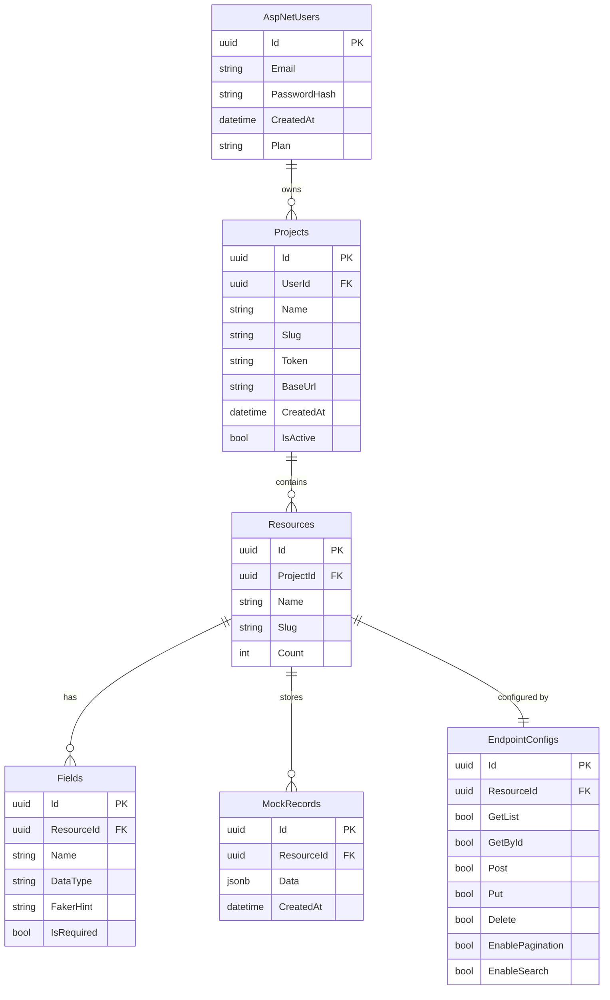

---

## Cascade Delete Chain

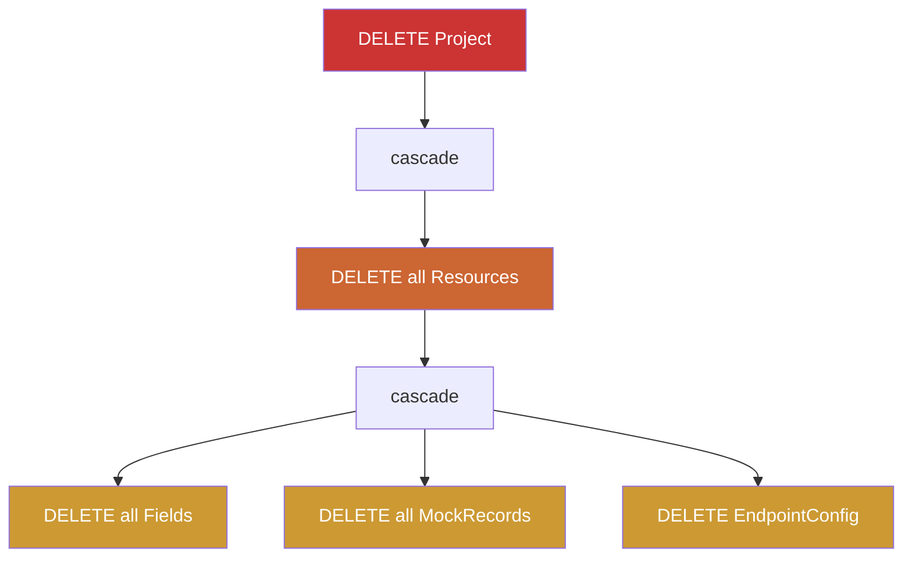

Configured in `OnModelCreating` via `OnDelete(DeleteBehavior.Cascade)` on all FK relationships.

---

## Dynamic Runtime URL Resolution

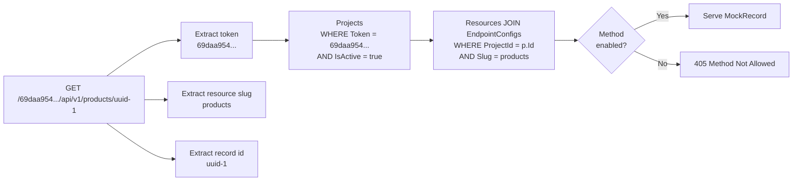

---

## Ownership Validation — Query Depth Per Operation

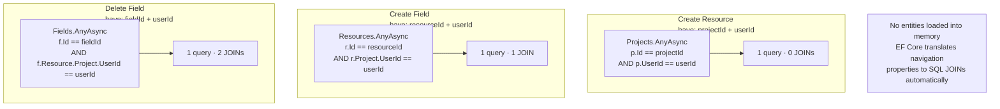

---

## Exception Middleware Pipeline

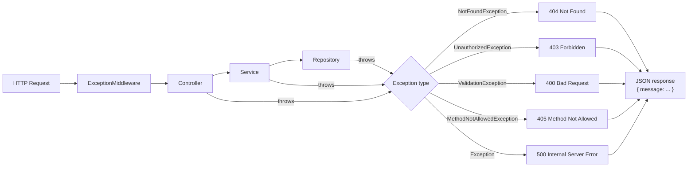

---

## FakerEngine — Data Generation Logic

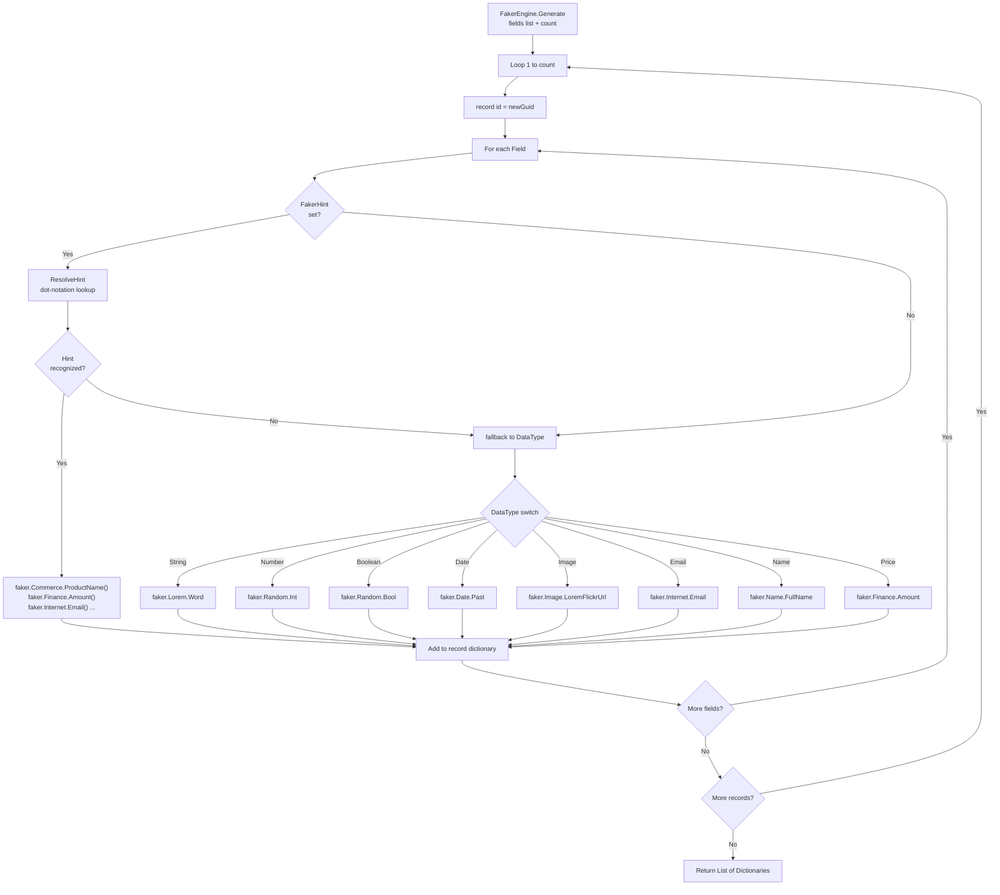

---

## Serialize / Deserialize Cycle

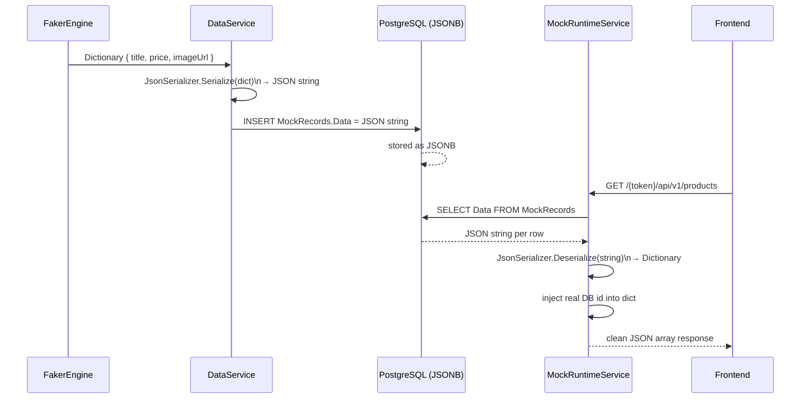

---

## URL Design

### Management API

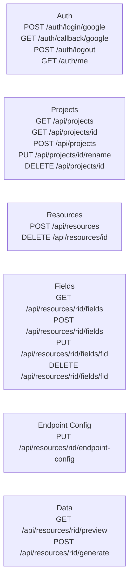

### Mock Runtime API (Public)

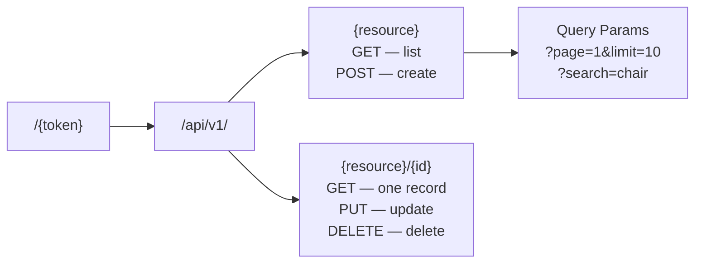

---

## Dependency Registration (Program.cs)

```mermaid
graph LR
    subgraph DI["Scoped Registrations"]
        direction TB
        R1[IProjectRepository → ProjectRepository]
        R2[IResourceRepository → ResourceRepository]
        R3[IFieldRepository → FieldRepository]
        R4[IEndpointConfigRepository → EndpointConfigRepository]
        R5[IDataRepository → DataRepository]
        R6[IMockRuntimeRepository → MockRuntimeRepository]
        S1[IProjectService → ProjectService]
        S2[IResourceService → ResourceService]
        S3[IFieldService → FieldService]
        S4[IEndpointConfigService → EndpointConfigService]
        S5[IDataService → DataService]
        S6[IMockRuntimeService → MockRuntimeService]
    end
```
