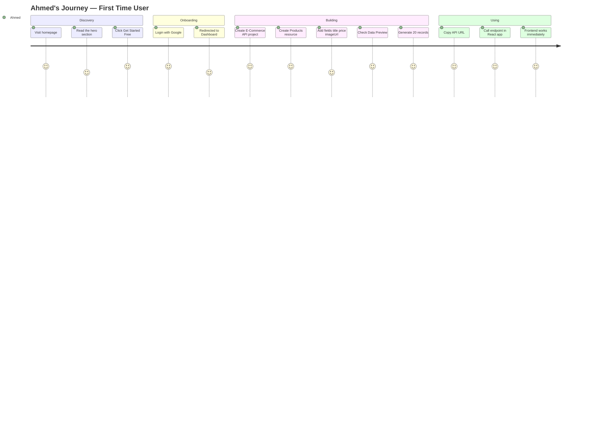
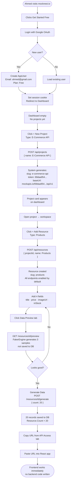
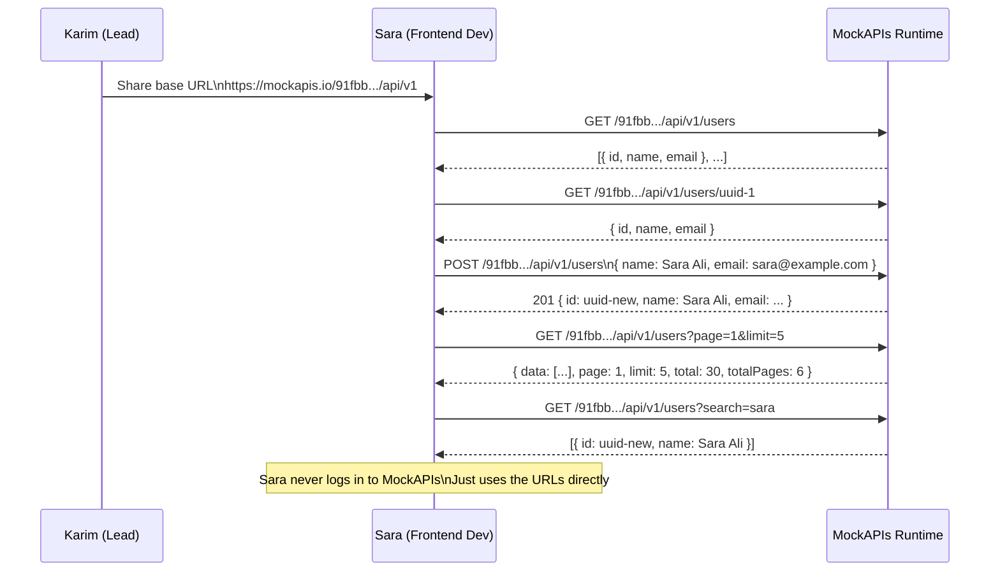
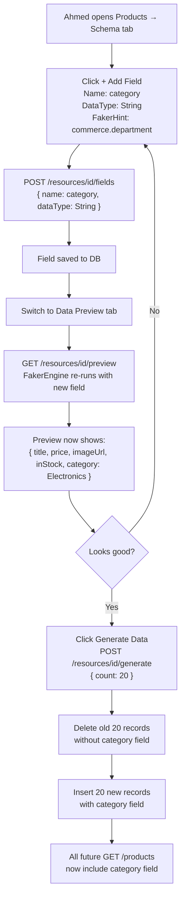
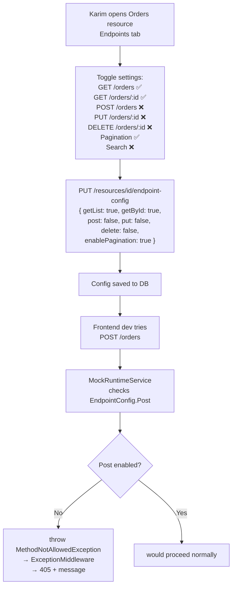
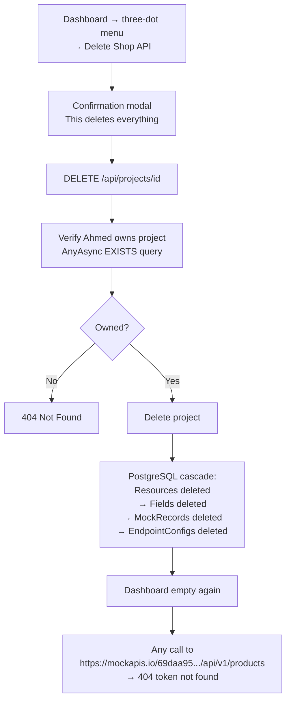
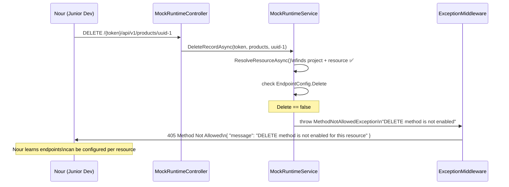
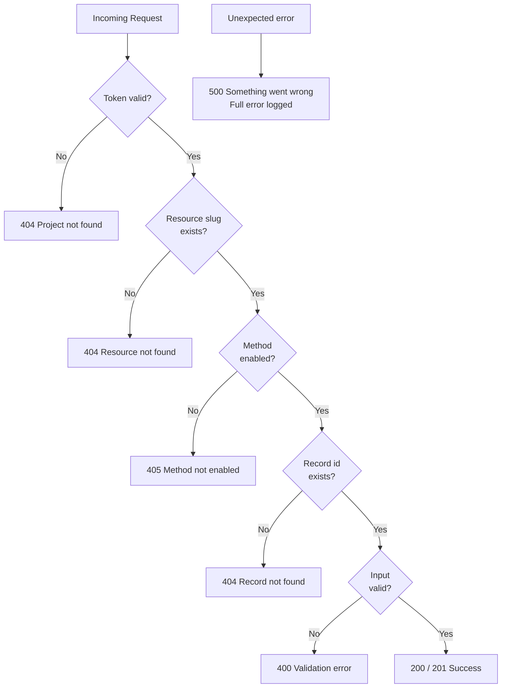

# MockAPIs — User Cases

## Who Uses MockAPIs

| User | Role | Goal |
|---|---|---|
| **Ahmed** | Full-stack developer | Build a personal project without writing backend first |
| **Sara** | Frontend developer at a startup | Start building UI before the backend team is done |
| **Karim** | Team lead | Give his 3 frontend devs a shared consistent mock API |
| **Nour** | Junior developer | Learn how REST APIs work by calling real endpoints |

---

## Use Case 1 — First Time User (Ahmed)

**Situation:** Ahmed wants to build an e-commerce frontend but has no backend yet.

### Step-by-step flow

---

## Use Case 2 — Frontend Developer Using a Shared URL (Sara)

**Situation:** Sara's team lead sends her a MockAPIs base URL. She uses it directly — no account needed.

---

## Use Case 3 — Updating the Schema Mid-Project (Ahmed)

**Situation:** Ahmed realizes he needs a `category` field on products after already generating data.

---

## Use Case 4 — Restricting Endpoints (Karim the Team Lead)

**Situation:** Karim wants his frontend team to only GET data, not POST or DELETE.

---

## Use Case 5 — Renaming and Deleting (Ahmed)

```mermaid
flowchart TD
    subgraph Rename["Renaming the project"]
        A[Three-dot menu → Rename] --> B["Type: Shop API"]
        B --> C["PUT /api/projects/id/rename\n{ name: Shop API }"]
        C --> D["System generates new slug:\nshop-api\nChecks global uniqueness"]
        D --> E{Slug unique?}
        E -->|No| F[shop-api-1]
        F --> E
        E -->|Yes| G[Update project\nname + slug in DB]
        G --> H[Dashboard card shows\nShop API]
    end

    subgraph DeleteResource["Deleting a Resource"]
        I[Right-click Reviews → Delete] --> J[Confirmation modal]
        J --> K["DELETE /api/resources/id"]
        K --> L["IsFieldOwnedByUserAsync\nAnyAsync EXISTS query"]
        L --> M{Owned?}
        M -->|No| N[404 Not Found]
        M -->|Yes| O[Delete resource from DB]
        O --> P["PostgreSQL cascade:\n→ DELETE Fields\n→ DELETE MockRecords\n→ DELETE EndpointConfig"]
        P --> Q[Sidebar no longer\nshows Reviews]
    end
```

---

## Use Case 6 — Deleting an Entire Project (Ahmed)

---

## Use Case 7 — Junior Dev Tests a Disabled Endpoint (Nour)

---

## Error Scenarios Summary

| Scenario | HTTP Code | Message |
|---|---|---|
| Wrong token in URL | 404 | Project not found |
| Wrong resource slug | 404 | Resource not found |
| Record id not found | 404 | Record not found |
| Accessing another user's project | 404 | Project not found (hides existence) |
| Method disabled | 405 | DELETE method is not enabled for this resource |
| Empty field name | 400 | Field name is required |
| Invalid DataType | 400 | Invalid data type 'Xyz' |
| Count > 1000 | 400 | Count cannot exceed 1000 records |
| Unexpected server error | 500 | Something went wrong |
