# MockAPIs — Detailed Workflow

## How a Request Flows Through the System

Every request follows this path through the 3-tier architecture:

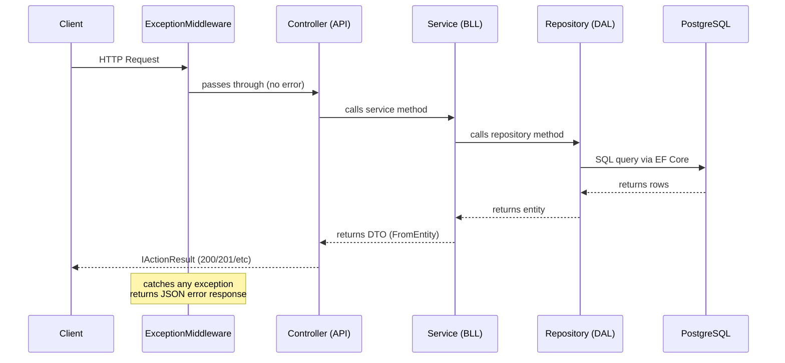

---

## Layer Responsibilities

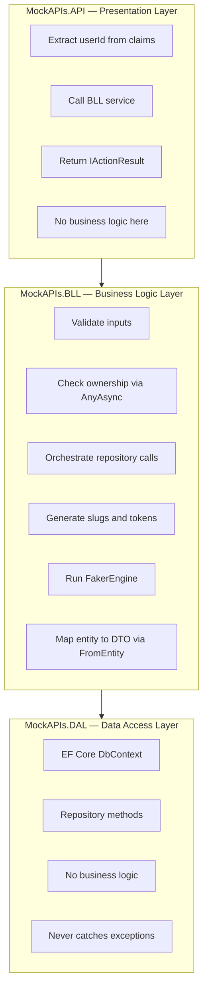

---

## Authentication Flow (OAuth)

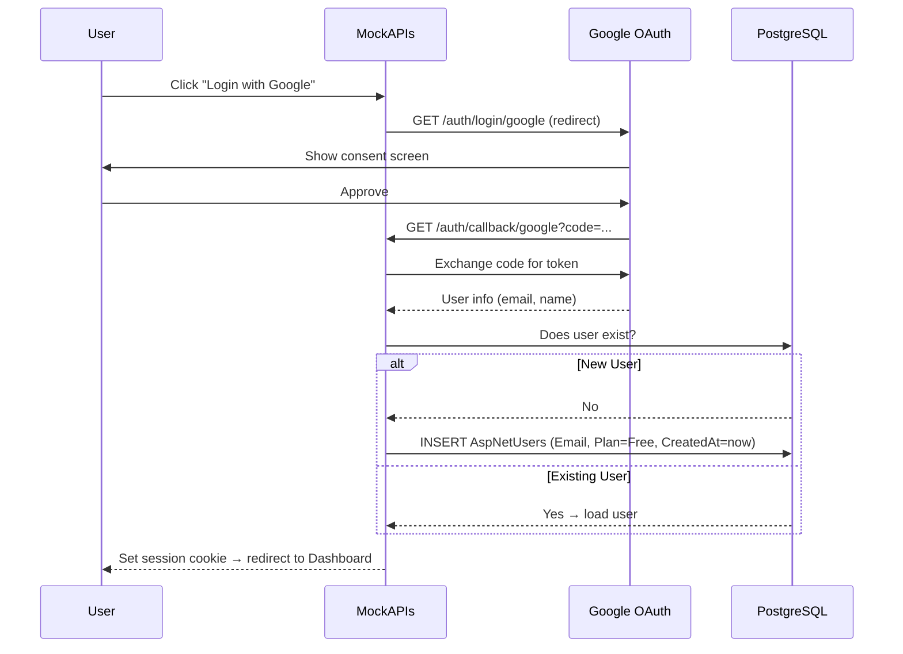

---

## Project Creation Flow

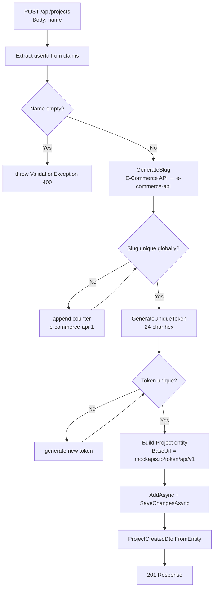

---

## Resource Creation Flow

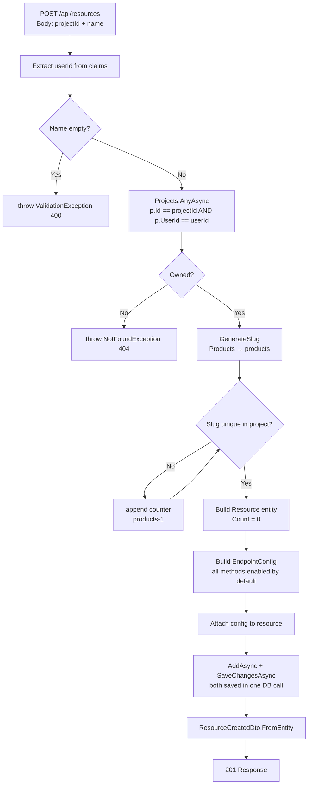

---

## Field Creation Flow

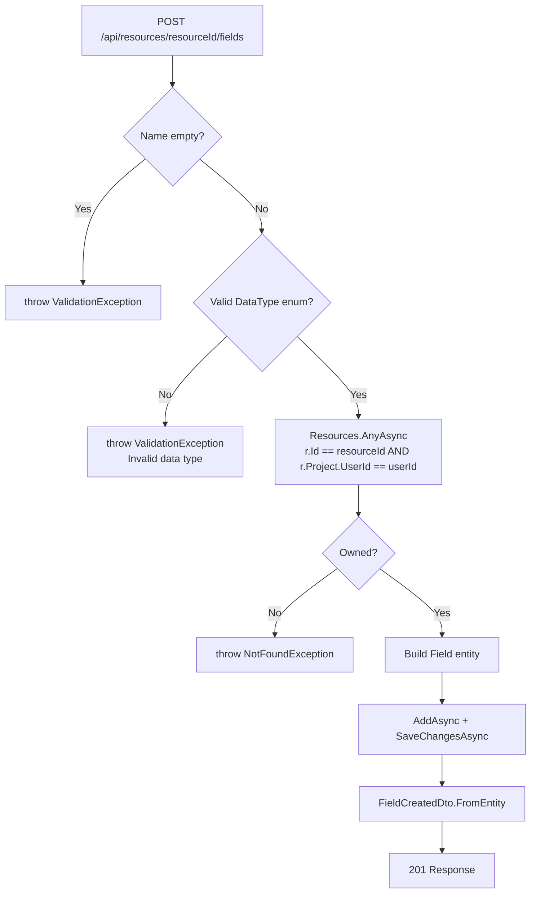

---

## Data Generation Flow

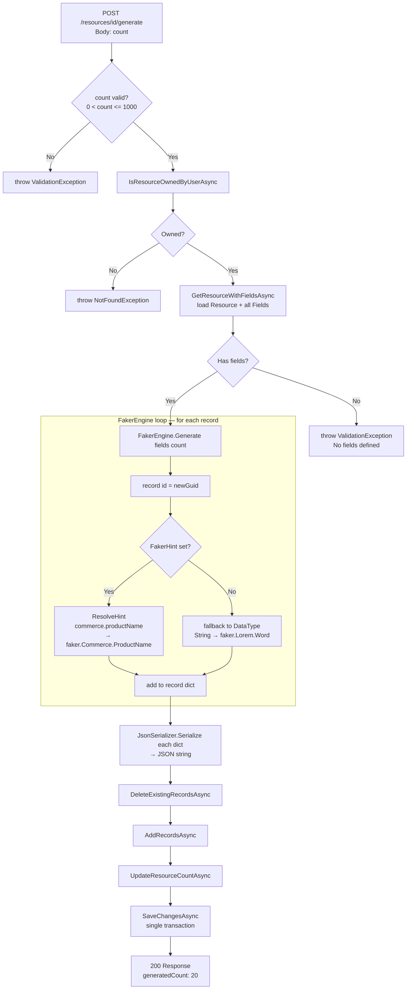

---

## Mock Runtime — GET List Flow

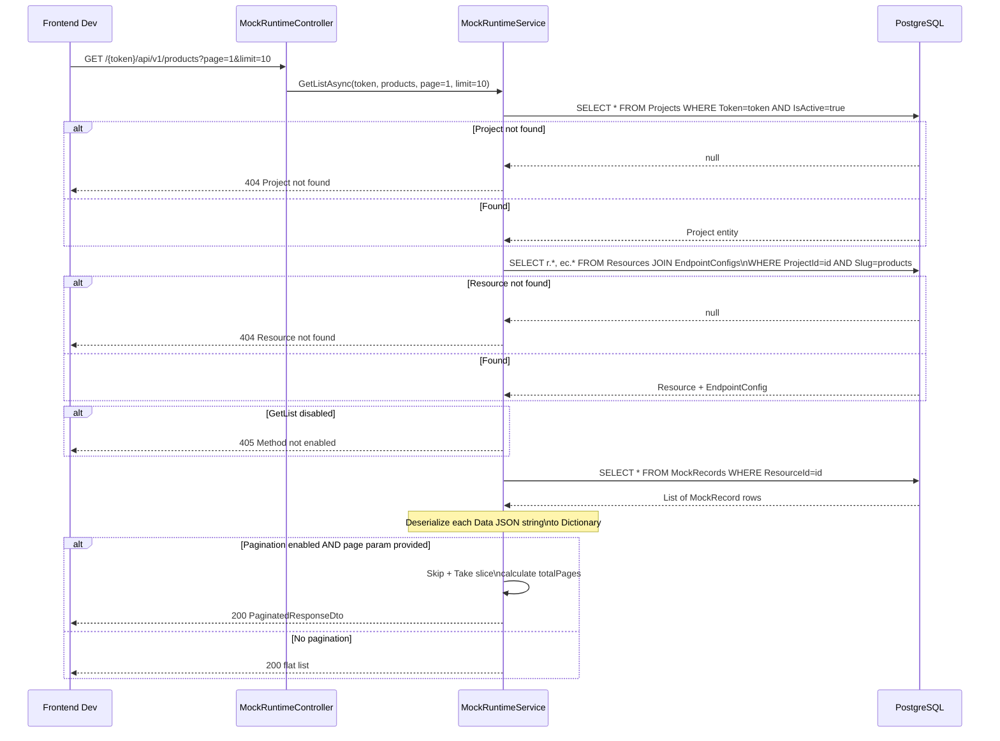

---

## Mock Runtime — POST (Create Record) Flow

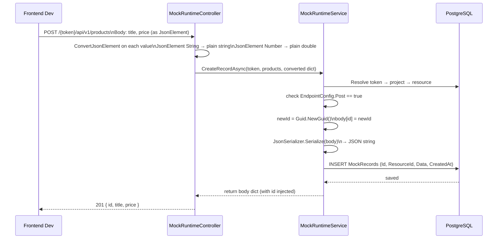

---

## Ownership Validation Strategy

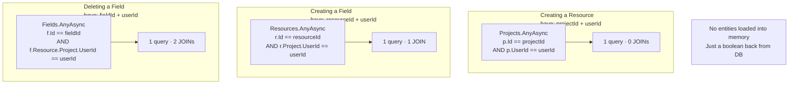

---

## Error Handling Flow

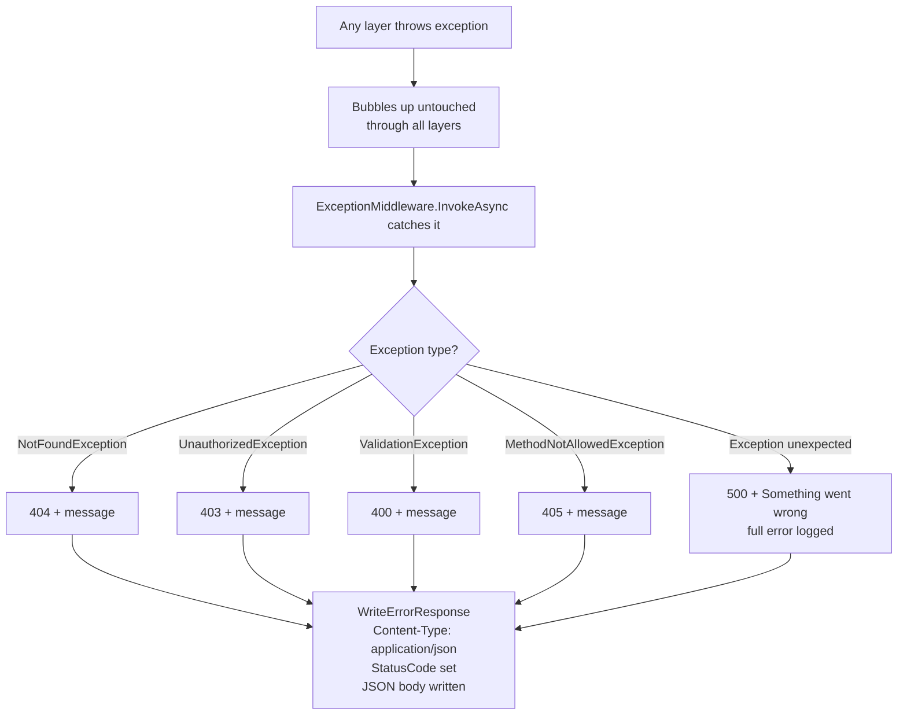

---

## Data Storage — Serialize / Deserialize Cycle

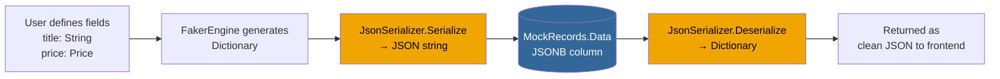

---

## Slug Uniqueness Rules

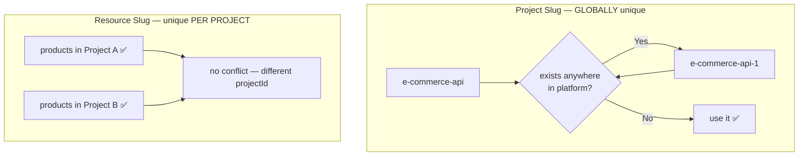
