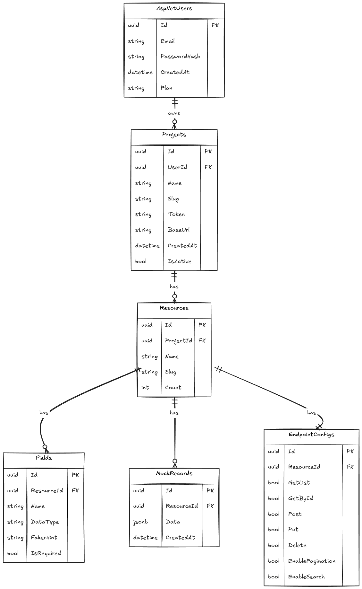
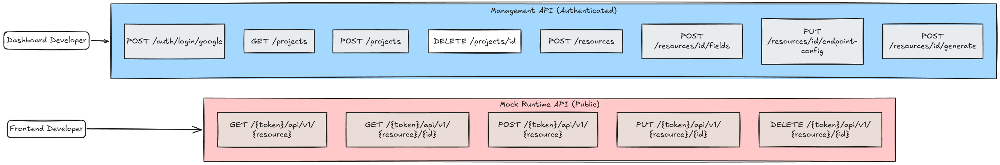

# MockAPIs (MockNest)

> **Build Frontend Without a Backend** — Create mock REST APIs in seconds.

---

## The Problem

Frontend developers need a backend API to build against. But in most teams, the backend isn't ready yet. This creates a bottleneck:

- Frontend devs are blocked waiting for the backend team
- They end up hardcoding fake data directly in the UI
- When the real API is ready, they have to rip out all the fake data
- Every team member has a different version of fake data — inconsistent and messy

Existing solutions like MockAPI.io solve this but are paid, limited, or closed source.

---

## The Solution

**MockAPIs** is a SaaS platform where developers:

1. Create an account and a **Project** (e.g. "E-Commerce API")
2. Define **Resources** inside that project (e.g. `products`, `orders`, `users`)
3. Add **Fields** to each resource (e.g. `title: String`, `price: Price`, `imageUrl: Image`)
4. Configure which **HTTP methods** are enabled (`GET`, `POST`, `PUT`, `DELETE`)
5. Click **Generate** — the platform uses the **Bogus** library to produce realistic fake data
6. Share a **live URL** with the frontend team

```
https://mockapis.io/69daa95426585bd92/api/v1/products
```

The frontend developer calls this URL exactly like a real API — no code changes needed when the real backend is ready, just swap the base URL.

---

## How It Works — User Journey


---

## Tech Stack

| Layer | Technology |
|---|---|
| Backend | ASP.NET Core Web API (.NET 9) |
| Architecture | 3-Tier (API → BLL → DAL) |
| Database | PostgreSQL with JSONB columns |
| ORM | Entity Framework Core 9 |
| Auth | ASP.NET Identity + OAuth (Google / GitHub) |
| Fake Data | Bogus (NuGet) |
| Hosting | Docker + VPS or Azure |

---

## Project Structure

```
MockAPIs/
├── MockAPIs.API/              # Controllers, Middleware, Program.cs
├── MockAPIs.BLL/              # Services, DTOs, Interfaces, Exceptions, Helpers
├── MockAPIs.DAL/              # Entities, DbContext, Repositories
└── MockAPIs.sln
```

---

## Database Design

Six tables power the entire platform:



---

## API Surfaces

MockAPIs exposes two distinct API surfaces:



---

## Key Features

- **OAuth Login** — Google and GitHub, no passwords stored
- **Project isolation** — each project has a unique token, URLs never conflict
- **Dynamic resource schema** — define any fields you want, any shape
- **Realistic fake data** — powered by Bogus with FakerHints like `commerce.productName`
- **Configurable endpoints** — enable/disable GET, POST, PUT, DELETE per resource
- **Pagination & Search** — optional query params `?page=1&limit=10` and `?search=chair`
- **Stateful mock** — POST/PUT/DELETE actually mutate the stored records
- **Cascade deletes** — deleting a project removes all resources, fields, and mock data automatically

---

## Getting Started (Local)

```bash
# Clone the repo
git clone https://github.com/yourname/MockAPIs.git
cd MockAPIs

# Set your connection string in appsettings.json
# "Host=localhost;Port=5432;Database=mock_apis;Username=postgres;Password=yourpassword"

# Apply migrations
dotnet ef database update --project MockAPIs.DAL --startup-project MockAPIs.API

# Run
dotnet run --project MockAPIs.API
```

---

## Why This Project Stands Out

- Solves a **real developer pain point** that existing paid tools address
- Uses **JSONB** columns for flexible schema-less data storage
- Implements a **dynamic catch-all controller** — one controller handles all mock endpoints by resolving token + resource slug at runtime
- Proper **ownership validation** using lightweight `AnyAsync` EXISTS queries instead of loading full entity hierarchies
- Clean **3-tier separation** with no AutoMapper — manual mapping keeps full control
- **Global exception middleware** — one place handles all errors with correct HTTP status codes